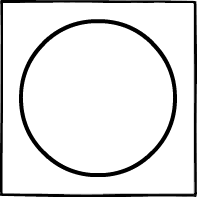

# knittingchartproject
The knitting chart display/work project

Key for filling out patterns:

: (k) Knit

: (yo) Yarn Over

: (p) Purl

: (k2tog) Knit 2 Together

: (k3tog) Knit 3 Together

: (p2tog) Purl 2 Together

: (rs) Start Repeat Section

: (re) End Repeat Section